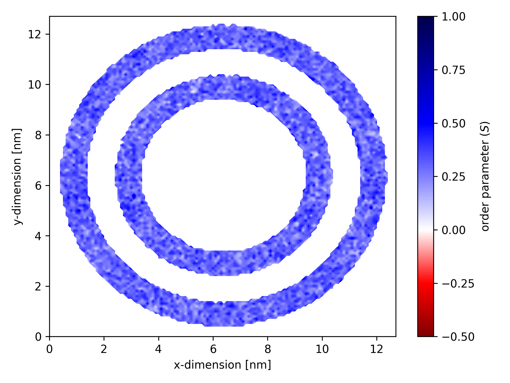

# Order parameters for complex membrane regions

As specified in [this section of the manual](geometry.md), `gorder` can be instructed to only calculate order parameters for bonds inside a region defined by a simple geometric shape — a cuboid, cylinder, or sphere.

In addition, `gorder` supports composite geometry shapes that can be constructed from the basic ones using logical operations — `and`, `or`, and `not`.

## `And` operator

The `and` operator combines two geometric shapes so that only the bonds that are inside **both** of them will be considered for the order parameter calculation.

```yaml
geometry: !And
  - !Cylinder
    radius: 3.0
    orientation: z
    reference: "Protein1"
  - !Cylinder
    radius: 3.0
    orientation: z
    reference: "Protein2"
```

In this example, order parameters will only be calculated for bonds that are at the intersection of the two cylinders localized around the proteins. *Note that here we must also [provide an NDX file](aaorder_basics.md#using-groups-from-an-ndx-file) with the groups `Protein1` and `Protein2` defined.*

## `Or` operator

The `or` operator combines two geometric shapes, and only the bonds that are inside **either** of them will be considered for the order parameter calculation.

```yaml
geometry: !Or
  - !Cuboid
    x: [3.0, 5.0]
    y: [6.0, 8.0]
  - !Cuboid
    x: [6.0, 8.0]
    y: [3.0, 5.0]
```

In this example, order parameters will be calculated for bonds that are inside either of the two cuboids defining some rectangular regions of interest.

## `Not` operator

The `not` operator inverts the geometry of a shape so that only the bonds that are **outside** it will be considered for the order parameter calculation.
It can be applied to both simple geometric shapes (in which case it mimics the [`invert` keyword](geometry.md#inverting-the-selection)) and composite shapes (in which case it inverts the entire geometry).

```yaml
geometry: !Not
  - !Cylinder
    radius: 2.5
    orientation: z
    reference: !Center
```

Order parameters will be calculated for bonds that are outside the specified cylinder.

```yaml
geometry: !Not
  - !And
    - !Cylinder
      radius: 3.0
      orientation: z
      reference: "Protein1"
    - !Cylinder
      radius: 3.0
      orientation: z
      reference: "Protein2"
```

Order parameters will be calculated for all bonds *except* those at the intersection of the two cylinders.

## More complex shapes

The individual operations can be combined into binary trees to create shapes with arbitrary complexity.

For instance, here we create a region consisting of two concentric rings.

```yaml
geometry: !Or
  - !And
    - !Cylinder
      orientation: z
      radius: 4.0
      reference: !Center
    - !Not
      - !Cylinder
        orientation: z
        radius: 3.0
        reference: !Center
  - !And
      - !Cylinder
        orientation: z
        radius: 6.0
        reference: !Center
      - !Not
        - !Cylinder
          orientation: z
          radius: 5.0
          reference: !Center
```

If we plot a [map of order parameters](ordermaps.md), the result may look like this:


