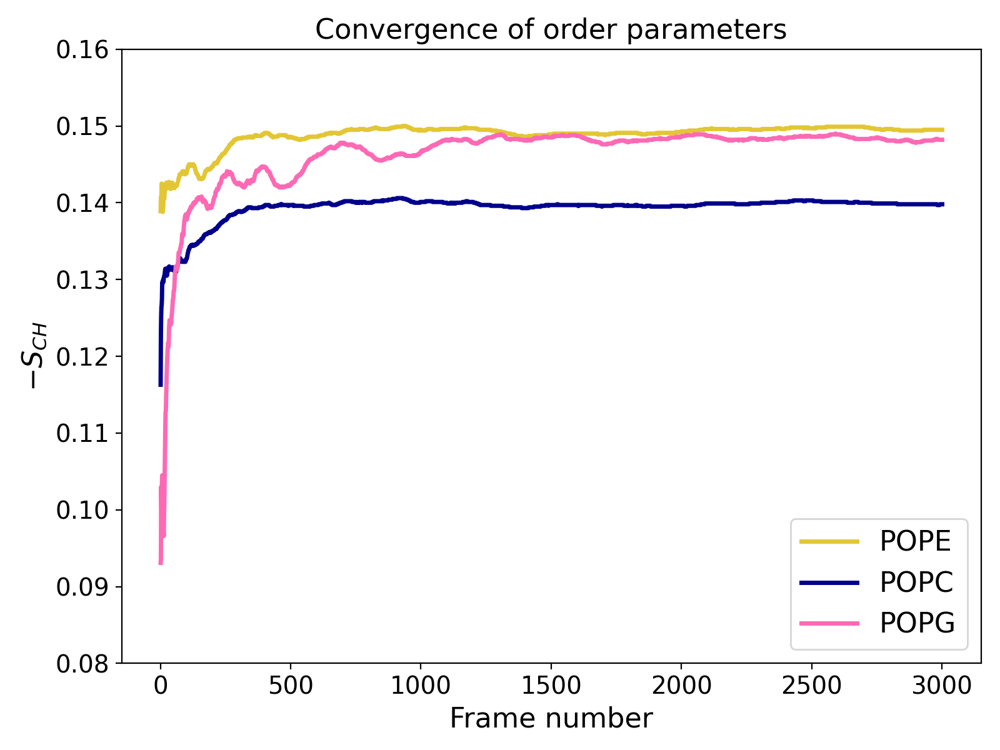

# Estimating errors

`gorder` is able to provide estimates of error for the individual bonds, atoms, and entire molecules.

The primary source of error when calculating order parameters from molecular dynamics simulations is the lack of convergence in the simulation. It’s also important to note that an order parameter calculated from a single trajectory frame is very unreliable unless the system is gigantic and contains many molecules. Using the standard deviation or standard error calculated from order parameters of individual frames or even samples is therefore not a viable option. Instead, `gorder` uses block averaging to calculate an error that reflects how well the simulation has converged.

To estimate the error, the trajectory is divided into blocks (default: 5). Each block represents a sequential portion of the trajectory: for example, the first fifth of the frames make up block #1, the second fifth forms block #2, and so on. The average order for each bond is calculated within each block, and a **sample standard deviation** is calculated from these block averages. This standard deviation is reported as the error. For simulations that are well-converged and have large enough blocks, the standard deviation between the blocks will be small.


## Requesting error estimation

By default, `gorder` does not calculate error estimates. To enable error estimation, include the following line in your configuration YAML file:

```yaml
estimate_error: true
```

The output YAML file will then include error estimates and may look similar to this:

```yaml
# Order parameters calculated with 'gorder v0.6.0' using a structure file 'system.tpr' and a trajectory file 'md.xtc'.
average order:
  total:
    mean: 0.1631
    error: 0.0014
POPE:
  average order:
    total:
      mean: 0.1601
      error: 0.0015
  order parameters:
    POPE C22 (23):
      total:
        mean: 0.1036
        error: 0.0017
      bonds:
        POPE H2R (24):
          total:
            mean: 0.0876
            error: 0.0054
        POPE H2S (25):
          total:
            mean: 0.1196
            error: 0.0033
    POPE C32 (32):
      total:
        mean: 0.2297
        error: 0.0045
      bonds:
        POPE H2X (33):
          total:
            mean: 0.2423
            error: 0.0052
        POPE H2Y (34):
          total:
            mean: 0.2171
            error: 0.0045
#(...)
```

The errors are also reported in CSV and table files but **not** in XVG files:

```csv
molecule,residue,atom,relative index,total,total error,hydrogen #1,hydrogen #1 error,hydrogen #2,hydrogen #2 error,hydrogen #3,hydrogen #3 error
POPE,POPE,C22,23,0.1036,0.0017,0.0876,0.0054,0.1196,0.0033,,
POPE,POPE,C32,32,0.2297,0.0045,0.2423,0.0052,0.2171,0.0045,,
POPE,POPE,C23,35,0.2138,0.0034,0.2139,0.0025,0.2138,0.0047,,
POPE,POPE,C24,38,0.2165,0.0022,0.2158,0.0035,0.2172,0.0038,,
(...)
```

```text
Molecule type POPE
                TOTAL       |    HYDROGEN #1    |    HYDROGEN #2    |    HYDROGEN #3    |
C22        0.1036 ± 0.0017  |  0.0876 ± 0.0054  |  0.1196 ± 0.0033  |                   |
C32        0.2297 ± 0.0045  |  0.2423 ± 0.0052  |  0.2171 ± 0.0045  |                   |
C23        0.2138 ± 0.0034  |  0.2139 ± 0.0025  |  0.2138 ± 0.0047  |                   |
C24        0.2165 ± 0.0022  |  0.2158 ± 0.0035  |  0.2172 ± 0.0038  |                   |
(...)
```

> Error estimates are currently **not** available for individual [ordermaps](ordermaps.md).

## Changing the number of blocks

If you are unsatisfied with the default number of blocks (5), you can adjust this parameter:

```yaml
estimate_error:
  n_blocks: 10
```

For example, setting `n_blocks: 10` will use 10 blocks for error estimation instead of the default 5. You should avoid tweaking this number to get a lower error estimate.

## Convergence analysis

`gorder` offers an additional method to assess simulation convergence by visualizing how the average order parameters evolve over time for individual molecules.

To request convergence analysis, include the following lines in your configuration YAML file:

```yaml
estimate_error:
  output_convergence: convergence.xvg
```

This will not only estimate errors as described above but also generate an XVG file (e.g., `convergence.xvg`) which shows the order parameters calculated for each frame as the average of values from that frame and all preceding frames (i.e., prefix averages).



The example plot illustrates a relatively well-converged atomistic simulation where approximately 3,000 trajectory frames were analyzed. The chart shows that results for POPE and POPC lipids stabilize early (within the first third of the trajectory), while POPG converges more slowly (which is due to the smaller number of these lipids in the system).