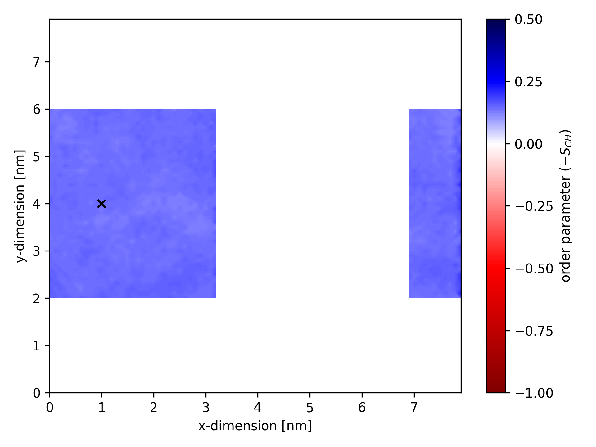
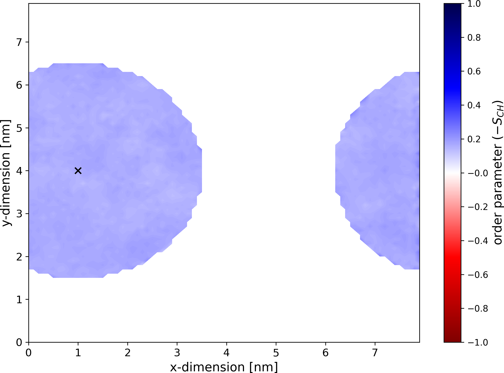
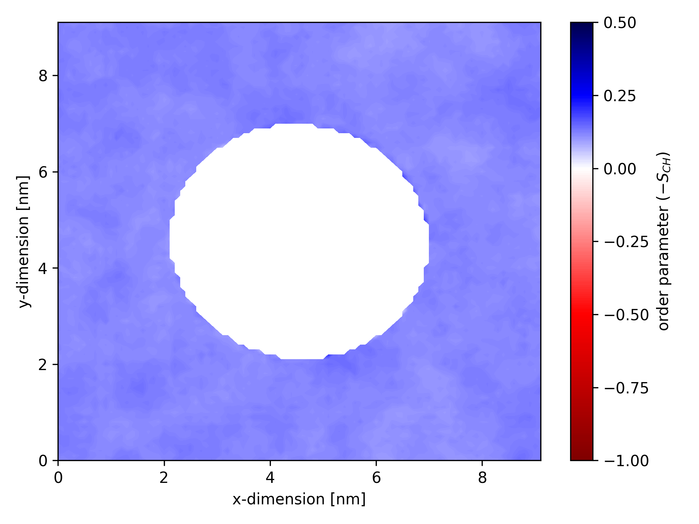

# Order parameters for a specific membrane region

`gorder` allows you to calculate order parameters for a specific region of the membrane within a defined geometric shape. Currently, three geometric shapes are supported for this selection: [cuboid](#cuboid-selection), [cylinder](#cylindrical-selection), and [sphere](#spherical-selection). When a geometric shape is specified, only **bonds** located within that shape are included in the order parameter calculations. The bond's inclusion is dynamically evaluated for every frame of the trajectory. This feature is useful for instance when analyzing order parameters near transmembrane proteins or specific membrane regions.

> **Note:** The position of a bond is defined as the center of geometry of the bonded atoms.


## Cuboidal selection

You can define a cuboid with specific dimensions and position to calculate order parameters for bonds within that region. To define a cuboid, include a configuration like the following in your configuration YAML file:

```yaml
geometry: !Cuboid
  x: [2.0, 4.0]
  y: [1.0, 5.0]
  z: [0.0, 3.0]
```

This configuration calculates order parameters for bonds where the x-coordinate is between 2 and 4 nm, the y-coordinate is between 1 and 5 nm, and the z-coordinate is between 0 and 3 nm.

If a dimension is not specified, the cuboid is considered unbounded in that dimension, allowing bonds at any coordinate along that axis:

```yaml
geometry: !Cuboid
  x: [2.0, 4.0]
  y: [1.0, 5.0]
  # the cuboid is infinite along the z-dimension
```

You can also define a `reference` point to make the cuboid dimensions relative instead of absolute:

```yaml
geometry: !Cuboid
  reference: [3.0, 1.0, 0.0]
  x: [-2.0, 2.0]
  y: [1.0, 5.0]
```

In this example, the cuboid extends from 1 to 5 nm along the x-dimension, from 2 to 6 nm along the y-dimension, and remains infinite along the z-dimension. Periodic boundary conditions are also taken into account when constructing the cuboid.

The `reference` point can be defined as a static coordinate, a dynamic center of geometry of a specified group of atoms, or the center of the simulation box. For details, see [Specifying the reference point](#specifying-the-reference-point).

Below is an example of an ordermap where calculations considered only bonds within a specific cuboid. The static center of the cuboid is marked by a black `×`.



## Cylindrical selection

You can define a cylinder with specific dimensions, orientation, and position to calculate order parameters for bonds within that region. To specify a cylinder, include a configuration like the following in your configuration YAML file:

```yaml
geometry: !Cylinder
  reference: [3.0, 1.0, 4.0]
  radius: 2.5
  span: [-1.0, 1.0]
  orientation: z
```

This configuration calculates order parameters for bonds within a cylinder centered at x = 3 nm, y = 1 nm, z = 4 nm. The cylinder is oriented along the z-axis, has a radius of 2.5 nm, and a height of 2 nm (spanning from z = 3 nm to z = 5 nm). Periodic boundary conditions are also taken into account when constructing the cylinder.

The reference point for the cylinder can be defined as a static coordinate, a dynamic center of geometry of a specified group of atoms, or the center of the simulation box. If the `reference` value is omitted, the origin of the simulation box `[0, 0, 0]` is used. For more details, see [Specifying the reference point](#specifying-the-reference-point).

If the `span` parameter is omitted, the cylinder is considered infinitely long along its main axis (`orientation`):

```yaml
geometry: !Cylinder
  radius: 2.5
  orientation: z
```

In this case, the cylinder is centered at the origin `[0, 0, 0]`, has a radius of 2.5 nm, is oriented along the z-axis, and has an infinite height.

The main axis of the cylinder (`orientation`) must align with one of the simulation box dimensions. Only `x`, `y`, and `z` orientations are supported.

Below is an example of an ordermap where calculations considered only bonds within a specific cylinder (oriented along the membrane normal). The static center of the cylinder is marked by a black `×`.



## Spherical selection

You can define a sphere with a specific center and radius to calculate order parameters for bonds within that region. To specify a sphere, include a configuration like the following in your configuration YAML file:

```yaml
geometry: !Sphere
  reference: [3.0, 1.0, 4.0]    # you can also use `center` instead of `reference`
  radius: 2.5
```

This configuration calculates order parameters for bonds within a sphere centered at x = 3 nm, y = 1 nm, z = 4 nm, with a radius of 2.5 nm. Periodic boundary conditions are also considered when constructing the sphere.

The reference point (or center) for the sphere can be defined as a static coordinate, a dynamic center of geometry of a specified group of atoms, or the center of the simulation box. If the `reference` value is omitted, the sphere is centered at the origin of the simulation box `[0, 0, 0]`. For additional details, see [Specifying the reference point](#specifying-the-reference-point).

## Specifying the reference point

The reference point can be specified in one of three ways:

1. **Static coordinates**

Define a fixed reference point using explicit coordinates:

```yaml
reference: [2.0, 2.5, 1.5]
```

This places the reference point at x = 2.0 nm, y = 2.5 nm, and z = 1.5 nm. Note that these coordinates are **not** scaled by the simulation box dimensions.

2. **Dynamic center of geometry of selected atoms**

Set the reference point as the center of geometry of a specified group of atoms:

```yaml
reference: "@protein"
```

Here, the reference point corresponds to the geometric center of the `@protein` atom selection (all protein atoms in the system). The geometric center is recalculated for every frame of the trajectory. Use [GSL](gsl.md) syntax to specify the atom selection.

3. **Dynamic simulation box center**

Choose the center of the simulation box as the reference point:

```yaml
reference: !Center
```

The reference point will be the geometric center of the simulation box in all three dimensions, recalculated for every frame of the trajectory.

> If no reference point is specified, the default is the simulation box origin at `[0, 0, 0]`.

## Inverting the selection

If you want to **exclude** bonds that are inside the specified regions, you may want to *invert* the selection. The order parameters will then be calculated using bonds that are **outside** the selected areas.

To do this, include the `invert` keyword in your geometry selection:

```yaml
geometry: !Cylinder
  radius: 2.5
  orientation: z
  reference: !Center
  invert: true
```

This configuration calculates order parameters for bonds that are outside a cylinder with its center at the simulation box center, oriented along the z-axis, with a radius of 2.5 nm and an infinite height. If we plot an order parameter map for such a selection, it may look like this:



> Inverting is supported for all geometric shapes: cuboid, cylinder, and sphere.