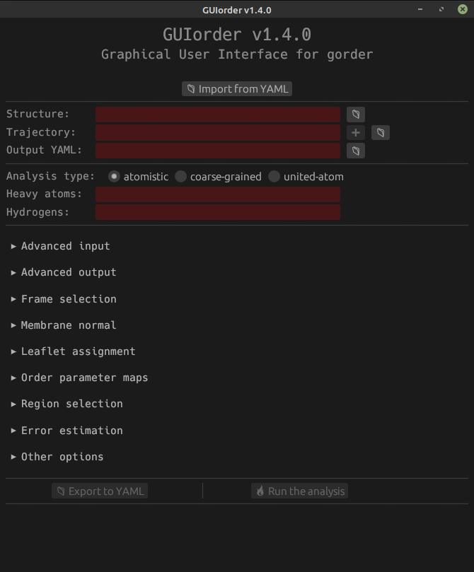
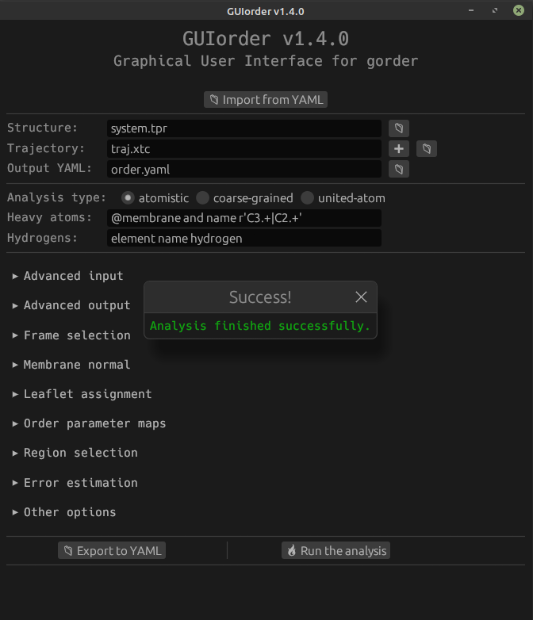
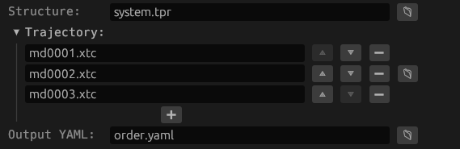
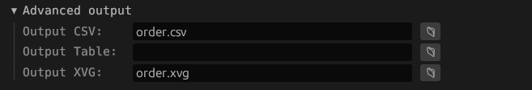
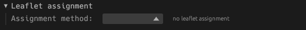
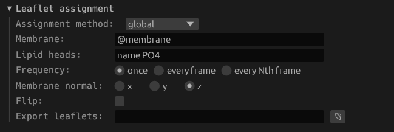
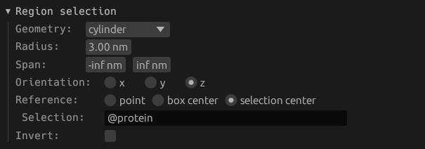
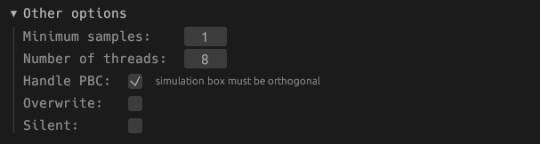

# Graphical user interface

If you don't want to bother with writing configuration files, you can use a companion tool called GUIorder, which provides a graphical user interface that simplifies writing configuration YAML files for `gorder`. In fact, if you use GUIorder, you don't have to touch the command-line application at all.

## Installation

Installing GUIorder is as simple as installing `gorder`. Once you have [Rust installed](https://rust-lang.org/tools/install/), just run:

```bash
cargo install guiorder
```

*You don't need to install `gorder` separately if you intend to use just the GUI application. GUIorder comes with its own instance of `gorder`.*

## Basic usage

To start GUIorder, run `guiorder` in your terminal. This opens the GUI, which should look similar to this:



Now you can either import a configuration YAML file by clicking the `Import from YAML` button just below the title, which opens an interactive file selection window, or you can construct the YAML file by filling in the interactive form.

Note the red background of some fields, indicating that these fields must be filled in.

Only the basic configuration options are displayed now; various others are hidden inside several collapsible sections below (e.g., `Advanced input`, `Leaflet assignment`, or `Region selection`).

At the bottom, you can see two grayed-out buttons titled `Export to YAML` and `Run the analysis`. These buttons cannot be clicked at this moment because our analysis configuration is not valid. GUIorder checks that the configuration you input makes sense and guides you on what parameters need to be provided.

If you're unsure about what a specific field means, hover your mouse over its title, and a helpful message will be displayed. The same goes for buttons.

In this example, we first fill in the `Structure`, `Trajectory`, and `Output YAML` fields, which are required. We then fill in the required parameters for the analysis type. Using the radio buttons, you can select between calculating order parameters for atomistic, coarse-grained, and united-atom systems.

> The version of GUIorder displayed in the title is the same as the version of `gorder` it uses, i.e., GUIorder is guaranteed to behave the same as the corresponding version of `gorder`. If you care about [semantic versioning](https://semver.org/), you should know that while `gorder` follows it, GUIorder does **not**.


Notice that the fields are no longer colored red, indicating they are valid.

We have manually provided the names of the input and output files by writing into the fields, but they can also be selected interactively by pressing the button with the folder icon next to each field. Pressing this button opens a file selection window.

We can now run the analysis by pressing the `Run the analysis` button since we have provided all the required parameters.

When you press the `Run the analysis` button, a spinner with the text "Analysis is running. See the terminal for more details." will appear below the last two buttons. GUIorder does not provide any information about the progress of the analysis itself, but this information is written into the terminal as in a normal `gorder` run *(that is because internally, GUIorder invokes `gorder` and just provides it with input parameters for the analysis)*.


Once (or if) the analysis finishes successfully, a window titled `Success!` will appear. The output files are then written normally, and you can check them out. You can modify the input parameters and rerun the analysis, export the input parameters into a configuration file by pressing the `Export to YAML` button (very useful for reusability), or simply exit the application.



If an error is encountered, a similar window stylized in red will appear, informing you about the reason for failure. For more information about the run, see the output of `gorder` in the terminal.

## Advanced usage

Let's backtrack a bit and continue the previous example, showing some more advanced features of GUIorder. To follow along, it may be helpful to first read the "Advanced" chapters of this manual.

If you are analyzing multiple trajectory files, you can either select all of them interactively (by pressing the button with the folder icon) or by pressing the `+` button, which expands the form.



Here, we have specified three trajectory files to analyze. To change their order, you can use the `^` and `⌄` buttons. To remove a file from the list, press the `−` button next to the field. You can also add more files by pressing the `+` button, now positioned below.

However, in this example, we want to analyze a single trajectory file, so we revert to the previous state and continue.

Currently, we are only writing the order parameters into the output YAML file. But we would also like to write them into a CSV file and XVG files. To do that, we click on the `Advanced output` section, expanding it, and fill in the file names.



GUIorder supports (almost) everything the command-line `gorder` does, so we can also specify more advanced configurations, such as leaflet assignment. If we expand the `Leaflet assignment` section by clicking on it, we see that by default, no leaflet assignment is performed.



We can select the assignment method from the provided list and fill in the parameters for it. Here, we select the `global` leaflet assignment method (see [this section of the manual](leaflets.md) for more details about leaflet assignment). GUIorder will guide you to provide all the parameters required for this method. If you are still unsure, hover over the text left of the field to display a short help message or refer to this manual.



Another advanced configuration we want to provide is region selection. If we expand the `Region selection` section, we see that, as with leaflet assignment, no region is selected by default, i.e., the entire system is analyzed.


We can change that by selecting the appropriate geometric shape using which we want to specify the region of interest. Here, we select the cylinder and provide parameters for it (see [this section of the manual](geometry.md) for more details about region selection).



There are many more advanced sections to explore, but for the sake of brevity, we will showcase only one last section: `Other options`. Here you can set all the parameters that do not fit elsewhere, and we use it to increase the number of threads used to run the analysis from one (default) to eight (see [this section of the manual](multithreading.md) for more details about multithreading).



Now we can scroll down, and run the analysis!